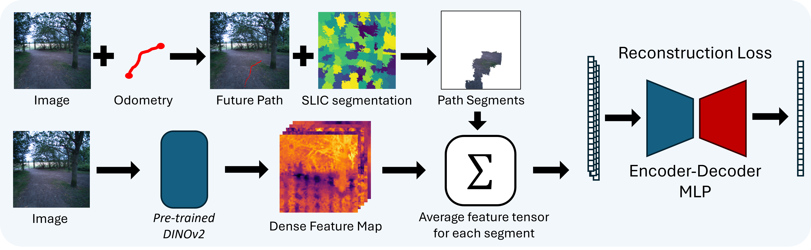

# Watch your STEPP: Semantic Traversability Estimation using Pose Projected Features #


**Authors**: [Sebastian Aegidius*](https://rvl.cs.toronto.edu/), [Dennis Hadjivelichkov](https://dennisushi.github.io/), [Jianhao Jiao](https://gogojjh.github.io/), [Jonathan Embly-Riches](https://rpl-as-ucl.github.io/people/), [Dimitrios Kanoulas](https://dkanou.github.io/)

<div style="text-align: center;">

[Project Page](https://rpl-cs-ucl.github.io/STEPP/)  [STEPP arXiv](https://arxiv.org/)

</div>




## Installation ##
```bash
conda create -n STEPP python=3.8
conda activate STEPP
cd
# We use cuda 12.1 drivers/
pip3 install torch torchvision torchaudio --index-url https://download.pytorch.org/whl/cu121
```
Place the repository in your catkin workspace of choice with your planner of choice implementation, we used the CMU Falco local planner from their [autonomous exploration development environment](https://www.cmu-exploration.com/).

```bash
# Assuming an already setup and built ros workspace (workspace containing cmu-exploration, or any other navigation stack)
cd your_navigation_ws/src
git clone git@github.com:RPL-CS-UCL/STEPP-Code.git
cd STEPP-code
pip install -e .
cd ../../..
catkin build STEPP_ros
```


For installation of Jetpack, Pytorch, and Torchvision on your Jetson Platform: [Link](https://pytorch.org/audio/stable/build.jetson.html) and [Link](https://forums.developer.nvidia.com/t/pytorch-for-jetson/72048)
* Show jetpack version: ```apt-cache show nvidia-jetpack```
* [MUST] Create conda with python=3.8 and download wheel from this [link](https://nvidia.box.com/shared/static/i8pukc49h3lhak4kkn67tg9j4goqm0m7.whl)
* And then ```pip install torch-2.0.0+nv23.05-cp38-cp38-linux_aarch64.whl```
* Install Torchvision (check the compatiable matrix with the corresponding pytorch). 
    * Check this [link](https://forums.developer.nvidia.com/t/pytorch-for-jetson/72048/1285?page=63) for this issue: ```ValueError: Unknown CUDA arch (8.7+PTX) or GPU not supported```
    * Command: 
    ```
    pip install numpy && \
    pip install torch-2.0.0+nv23.05-cp38-cp38-linux_aarch64.whl && \
    cd torchvision/ && \
    export BUILD_VERSION=0.15.1 && \
    python setup.py install --user && \
    python -c "import torch; print(torch.__version__); print(torch.cuda.is_available()); import torchvision"
    ```
## Checkpoints ##

The following trained checkpoints are included in the repo:

| Modelname   | Dataset| Image resolutions| DINOv2 size |MLP architecture|
|-------------|--------|---------------------|-------------|---------|
| [`richmond_forest.pth`](\\wsl.localhost\Ubuntu-20.04\home\sebastian\code\STEPP-Code\checkpoints\richmond_forest_full_ViT_small_big_nn_checkpoint_20240821-1825.pth) |Richmond Forest| 700x700 | dinov2_vits14 |bin_nn|
| [`unreal_synthetic_data.pth`](https://download.europe.naverlabs.com/ComputerVision/DUSt3R/DUSt3R_ViTLarge_BaseDecoder_512_linear.pth)  |Unreal engine synthetic Data| 700x700 | dinov2_vits14 |big_nn|
| [`all_data.pth`](\checkpoints\unreal_full_ViT_small_big_nn_checkpoint_20240819-2003.pth)|Richmond Forest, Unreal synthetic Data | 700x700 | dinov2_vits14 |big_nn|

## Usage ##
to launch the model, set all required paths correctly and build your workspace and run: 
```bash
roslaunch STEPP_ros STEPP.launch
```

### STEPP.launch Arguments
- "model_path": Path to your chosen checkpoint.pth file 
- 'visualize': decides if you want to output the overlayed traversability cost onto the image feed (slows inference time)
- 'ump': option to use mixed precision for model inference. Makes inference time faster but requires retraining of model weights for best performance
- 'cutoff': sets the value for the maximum normalized reconstruction error
- "camera_type": [zed2, D455, cmu_sim] - sets the chosen depth projection camera intrinsics
- "decayTime": (unfinished) how long do you want the depth pointcloud with cost to be remembered outside the decay zone and active camera view.

## Train Your Own STEPP inference model ##
to train your own STEPP traversability estimation model all you need is a dataset consisting of an image folder and an odometry pose folder. Here each SE(3) odometry pose has to relate to the exact location and rotation of the correlating image. With these two you can run the `extract_future_poses.py` script and obtain a json file containing the pixels that represent the cameras future poses in the given image frame. 

With this json file and the associated images you can run the `make_dataset.py` file to obtain a `.npy` of the DINOv2 feature averaged vectors of each segment that the future poses in each image from your dataset belonges to. this can in turn be used to train the STEPP model on using `training.py`

### Acknowledgement
https://github.com/leggedrobotics/wild_visual_navigation\
https://github.com/facebookresearch/dinov2\
https://github.com/HongbiaoZ/autonomous_exploration_development_environment

### Citation
If you think any of our work was useful, please connsider citing it:

```bibtex
Coming soon
```

